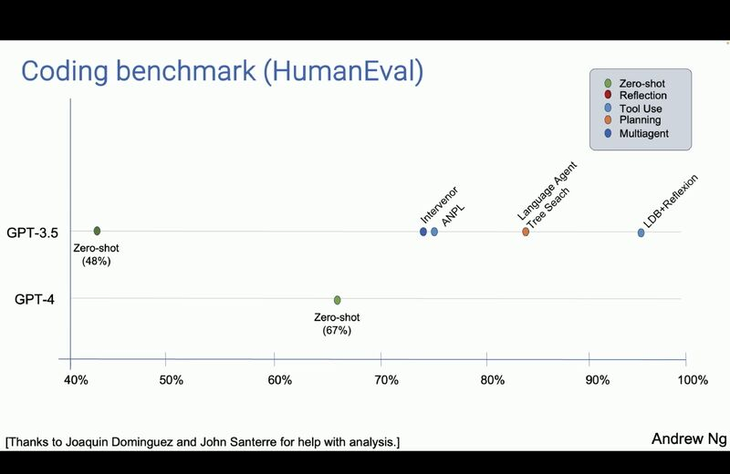
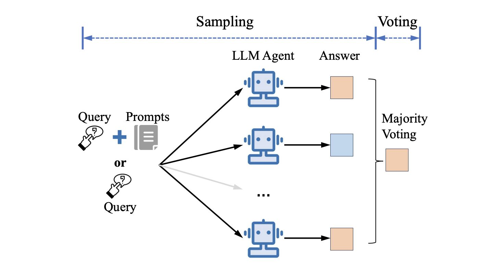

# 🌌 Nebulous AI
## Create AI agents for your own use case quickly.

AI agents are the future of automation and LLMs. Nebulous helps you create agents:
* For your own business use case
* In just 5 lines of code
* By using the best agent algorithms 

It's easy to learn and get started with. Ready to create your first agent in just 5 lines of code? [Learn how.](https://github.com/sarthakrastogi/nebulousai/tree/main?tab=readme-ov-file#create-ai-agents-with-top-performing-algorithms-quickly)

# Learning Resource: AI Agents

## What's an agent?

It's an program which can call LLMs to plan a task ahead and make decisions to use tools and memory at its disposal.

---

## Why use agents?

Why do we need agents? Why not make a 1-shot LLM call?

Andrew Ng’s analysis gives all the proof you need.

An agent made with a smaller model can outperform a much larger model.

GPT-3.5 agents do 1.4x better than GPT-4 on code generation, measured on HumanEval.

Tool use, reflection, planning and multi-agent collaboration can all add to an agent successfully completing a task.

## Components of an agent

### Brain

### Planner

### Tool Use

An agent may need to call external tools if it needs to:

* Call external APIs for knowledge not present in the model’s training data (or the model cannot be relied upon to recall it without hallucinating).
* It needs to answer with up-to-date info in its context.
* It needs a code interpreter, data visualiser, etc.
* The info needed for the task at hand requires authentication to access.

### Memory

#### 1. Long Term Memory

Long form context usually stored as embeddings to search upon and reference when the agent needs consult domain knowledge. Especially used to limit hallucinations.

#### 2. Short Term Memory

Memory accumulated while the agent is performing a task.

## How to build agents

Cornell study finds that agents built on an algorithm as simple as sampling and voting performs much better than LLM calls. More importantly, it scales in performance with the number of agents involved.

How does it work?

Sampling and voting initialises an empty set and iterates N times to generate samples using a language model or combined methods.

Each sample undergoes pairwise comparison with others in the set to compute similarity scores based on a chosen similarity metric.

The decision is made by selecting the sample with the highest aggregated similarity score.

Paper: https://lnkd.in/gwRNuB7e

## Multi-Agent Systems

### Why use multi-agent systems

Multi-agent systems will replace single agents in most production settings.

They’re inherently more robust and prod-ready.

- If one agent fails or encounters a limitation, other agents with complementary skills can provide it more context to complete its task. You can have error correction agents dedicated to this.

- Each agent in a multi-agent system can specialise in its own topic and have its own unique perspective or expertise.

    This diversity allows the system to find the best possible agent for the task -- or even approach problems from multiple angles, increasing the likelihood of succeeding on the task.

#### Division of labour

Perhaps the biggest driving factor towards LLM-based multi-agent systems is division of labour.

It opens up solutions like:

- Searching through smaller knowledge bases made/indexed specific to that agent’s expertise, which is faster and more accurate.

- Using custom made LLMs for each purpose — each of which can be smaller to save compute.

- And of course, less dependence between agents, keeping regression low while prompt engineering, and hence saving dev time by a huge margin.

### Disordered vs Ordered Cooperation

While making a multi-agent system, the biggest challenge I face is finding the balance between a disordered vs an ordered cooperative approach. It’s a make or break decision.

Having a pre-defined protocol for multiple agents to write their responses in, means you don’t allow the system to go back and revise its plan unless stated in the protocol — even if an agent advises/requires it.

Having a disordered cooperative approach means the agents are rarely able to collaborate or presenting the final plan in a constrained number of steps.

If you’ve listened to a parliamentary debate, you know what I’m talking about. 🙂

Tuning to the right tradeoff makes all the difference between a working system and an infinitely spiralling pack of baboons.

Building an agent takes days. Defining this tradeoff takes weeks, real world data, and accounting for distribution shift.