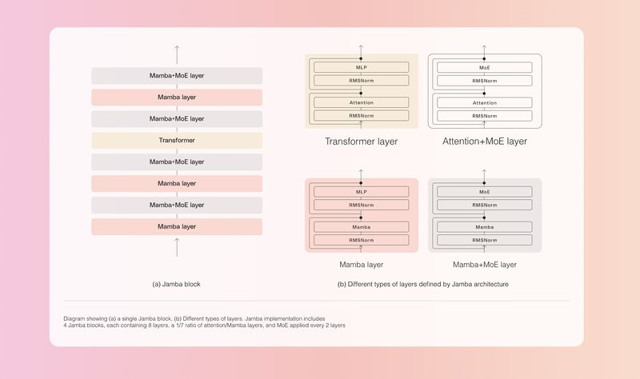
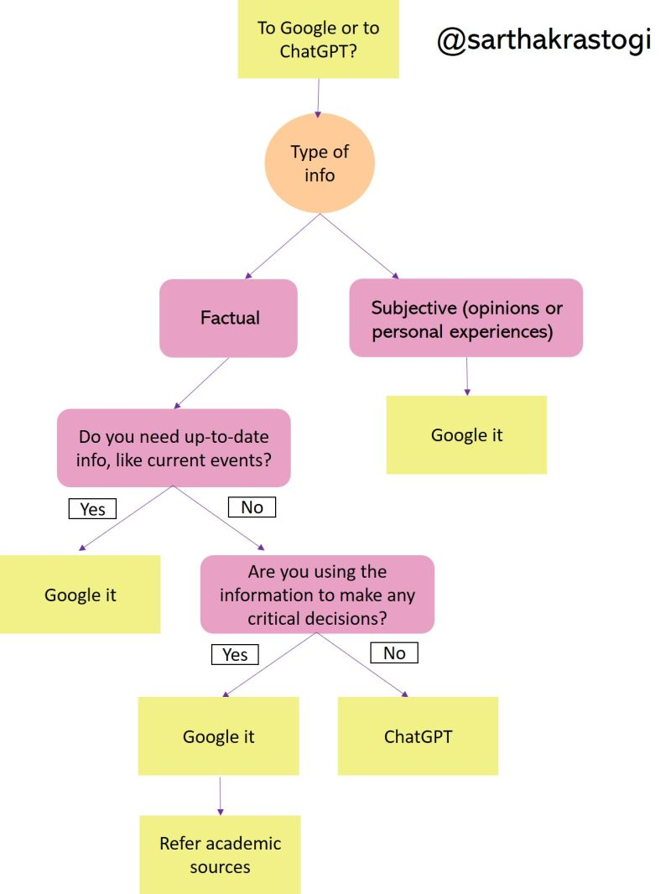
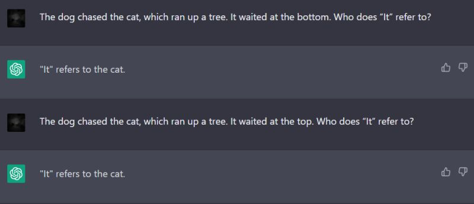
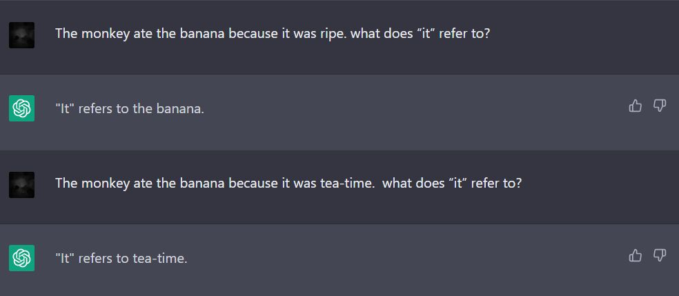

# 🌌 Nebulous AI
## Create AI agents for your own use case quickly.

AI agents are the future of automation and LLMs. Nebulous helps you create agents:
* For your own business use case
* In just 5 lines of code
* By using the best agent algorithms 

It's easy to learn and get started with. Ready to create your first agent in just 5 lines of code? [Learn how.](https://github.com/sarthakrastogi/nebulousai/tree/main?tab=readme-ov-file#create-ai-agents-with-top-performing-algorithms-quickly)

# Learning Resource: LLMs

## Why Deep Learning for Language Modelling?

Because of Moore’s Law.

I often used to wonder — why isn’t it more commonplace to train ML models and agents assisted by domain expert feedback? Wouldn’t these agents perform awfully well?

It sounds like Sci-fi — reinforcing an agent or model on everything one knows about their field of expertise. And it would take forever too. But in the end, I thought, you end up with a copy of a domain expert’s approach to problems on their topic.

Even if it doesn’t turn out to be directly usable as an AI agent, this can be invaluable to an agent as a tool. Right? Well, I got the answer to this curiosity in this article today:

https://lnkd.in/e6R56WHC

- In the 90s, a brute force search-based method beat the world chess champion

- In the 2010s, a NN became the Go champion.

What’s common in both these models? Neither is built on human knowledge.

What’s more, Moore’s law means that once you’re done with a knowledge-based approach, enough compute would be available to beat it with a deep learning one anyway.

Rich Sutton observes:

“We want AI agents that can discover like we can, not which contain what we have discovered. Building in our discoveries only makes it harder to see how the discovering process can be done.”

**However**:

Once RNNs came out in 2014, no one talked about phrase-based statistical translation anymore.

Ever since Transformers came out in 2017, no one talks about RNNs or LSTMs anymore.

Phrase-based SMT had dominated NLP for 20 years. RNNs for around 3-5 years.

Best of luck, ChatGPT.

## How are LLMs built and trained?

There are two major architectures:
1. Transformers
2. Mamba

This also exists a combination of both which also performs very well.

This model achieved amazing LLM performance without solely relying on the Transformer arch: https://www.ai21.com/jamba

In an LLM, while the Transformer layer uses attention, the Mamba layer uses SSMs that dynamically filter info based on input content.

This is what lets the Mamba layer selectively remember or ignore parts of the input, akin to what attention does in most LLMS.

A Jamba block combines three Mamba layers with one Transformer layer to get:
- Better reasoning performance than comparably sized models
- 3X E2E throughput on context as long as 128k tkns.

AI21's not the first to make this cocktail (it's been done in MambaFormer before).

## How Do LLMs work?

Read: https://transformer-circuits.pub/2023/monosemantic-features/index.html

Then go through this implementation of LLama3 from scratch: https://github.com/naklecha/llama3-from-scratch

## Which LLM should you use?

### Open source or propreitary?

Eventually, all leading startups in their domains are bound to shift to open source models.
Consider two scenarios:

Scenario 1: You start off with Claude3, your product does well, you decide to switch to Llama3 to save costs.

You may have to spend weeks prompt engineering and reconfiguring, depending on the complexity of your LLM use case.

It's extremely time consuming -- but you have to either benchmark + prompt engineer an open source model, or keep bearing the cost delta between what Anthropic charges vs what your own model deployment (or even an inference endpoint) costs you.

Scenario 2: You start off with LLama3.

Your prompts and agents are built on an open source model from the beginning.

So if your inference endpoint provider (HF, Replicate, etc) starts charging more (or goes out of business, or stops supporting Llama3), you just deploy it yourself without having to change a thing about your product, or sacrificing performance until you prompt engineer another model.

It's not visible (sometimes not even relevant) in the beginning but there's a huge migration cost moving from GPT/Claude to open source -- and it's paid in prompt engineering and AI agent dev hours.

#### Open source models are starting to do better.

How does Llama 3 70B perform so well, even beating Claude 3 Sonnet? Part of it is in the data quality.

Meta used filtering techniques including heuristic filters, inappropriateness filters, semantic deduplication approaches, and text classifiers to predict data quality.

Also, Llama 2 was used to generate synthetic training data (which is a bit questionable -- the ouroboros problem with feeding LLM-generated content to another LLM).

Finally, they put a lot of effort into finding the best data mix from various sources. They experimented with different combinations from various sources, like web text, books, articles, and other sources, and then evaluated to find the best mix to use.

### How many params among 3B - 70B models?

**RAM**

3B: 8GB RAM for simpler tasks.
7B: ~14GB VRAM for mid-range apps.  
13B: ~16GB RAM, 10GB+ VRAM GPU.
33B: ~20GB RAM, high-end GPU like RTX 3080.
70B: 16GB+ RAM, powerful GPU like RTX 3090 or multi-GPU setup.

**GPU**

3B: 8GB VRAM (RTX 3060)
7B: 14GB VRAM (RTX 3060) 
13B: 16GB VRAM (RTX 3080)
33B: 24GB VRAM (RTX 3090)
70B: 35GB+ VRAM (2x RTX 3090 or 4x A6000)

A bit misleading trend I've been seeing in open source LLM releases: many startups claim that their model can fit into a single consumer GPU.*

* GPU requirement = 100GB.

No, that's not a consumer GPU, boss. Take that monstrosity to the cloud.

## What can't LLMs do for you?

### They can't reason or plan

When you give a puzzle to an LLM to test its reasoning captools, it finds a similar problem it say during its training, and tries to approximate an answer along the terms of this problem's solution.

It's not reasoning. It's not planning. It's just writing down what it learnt during training.

Read: https://arxiv.org/pdf/2403.04121.pdf

### You're best off not trusting LLMs to do math.

But with tool use, they can perform very well.

### .

Throughout the flood of AI-generated content, the only useful writing I've seen AI produce is that which is purely informative. And even then it's only useful when it parrots human-written text accurately.

Writing essays, stories, poems -- it's a valid use of AI for fun, but it's important not to miss the fact that it's a completely meaningless use case. All writing, except technical writing for the most part, is meant to introduce a new idea, which AI can't.

### Choose wisely whether to search or ask an LLM:

### They suck at anaphora resolution

Anaphora resolution is the task of identifying the antecedent of a pronoun or other referring expression in natural language text. Basically figuring out what a pronoun refers to in a sentence.

My AI Search Methods professor talked about it in a recent lecture, so I decided to see how well ChatGPT is doing. Not as well as you'd expect.

Successfully resolving the pronoun would need it to have better understanding of the semantics of pronouns, so it can understand relationships beteeen the referring expression and the antecedents much better.

### They're often racially and gender- biased

We should make it a standard process in the industry to project vectors onto a non-bias direction if they’re supposed to be gender neutral after computing embeddings. In this case the non-bias direction would be the line dividing the vectors for each gender.

It's hard to mine natural language data that doesn't contain gender/racial biases, but the responsibility still lies with us to remove bias from the embeddings post-modelling.

#### Exhibit A:

The easiest way to ensure that the LLM you're releasing appears on the top of the charts -- simply overfit it on public benchmarks.

Paper from Scale AI studying the extent to which some of the leading LLMs are overfit on benchmarking datasets: https://lnkd.in/gKuRte7k

They kindly attribute this to dataset contamination :) But they also acknowledge that it's unlikely that this explains none of the models lying over the line of overfit.

What they did:
Make a new benchmarking dataset named GSM1k mirroring the GSM8k (Grade School Math) benchmark, and then evaluate leading LLMs on it, compared against GSM8k.

What they found:
- All models in some model families including Mistral and Phi are always overfit on GSM8k. GPT, Claude and Llama are not.
- They're still capable of reasoning (which I disagree with, but mentioning for completeness).

## Where to use LLMs

### For centralising company / institutional knowledge

Yes, LLMs are biased, but we can't ignore the unique way they reduce bias in business decisions.

Amongst all the talk of bias being learned by LLMs, we tend to forget a way AI can be the ultimate solution for removing organisational and human bias from decisions.

By aggregating and centralising knowledge. And by setting a protocol for every decision to be made to be standardised against this knowledge base.

This reduces organisational bias significantly. It allows all stakeholders knowledge and consensus to be present in each decision. How cool is that? No office politics, only data.

Whenever I listen to senior leaders who are using AI, this is an improvement I notice most companies using LLMs for decision making seem to enjoy. Whether by design or as a side effect. 

## Evaluating LLMs

TBH it's next to impossible to get a large enterprise to adopt any new ML solution if it can't be evaluated easily enough. LLMs are the biggest victim of this dilemma.

You can't improve what you can't measure, and with subjective tasks it takes a lot of manpower to test on a large enough dataset to prove significance.

You need subject matter experts writing down rubrics for determining whether a response is correct. You need people testing on these rubrics. And then people re-evaluating after every improvement is submitted.

"Automation will cut down time taken for most jobs" but how much time, how many dev hours, are taken to get to the point?

And once it's at that point, how many more to maintain it every time there's a data distribution drift?

Classification and ranking are everywhere, but LLMs have a long road full of evaluators ahead of them.

### Using LLMs

Evaluating LLM responses with another LLM is incredibly challenging. Here are some paradigms I follow:

* Evaluating each subtask in your agent flow and then making the final result’s success dependent upon the success of each subtask.

    When each step in a complex task is assessed individually, it allows for more granular feedback and ensures that each subtask meets standards before moving on to the next. This also lays down the specific areas of improvement in the flow for you.

* Then, by evaluating retroactively to get a more holistic assessment, you can catch poor responses missed in isolated subtask evaluations.

* Finally, loop detection in the agent flow ensures that the system doesn't get stuck in repetitive cycles, and addresses latency issues.

### Using Metrics

## What To Build With LLMs

Building something useful with a moat around it.

Anything worth building (and buying) takes a long time, and this is something the small AI startups scene doesn't seem to understand.

In early 2023, after the launch of the GPT-3.5 API, I thought, "In a couple of months the industry will be flooded by AI startups." Instead, openai wrappers drowned out everything else in the market the same month.

I think the reason for this has a lot to do with how people perceive product building.

I've found that with anything worthwhile takes way more iterations than you initially plan. If it doesn't, there's either no moat or people don't need it. Scrap it, study the market, retry.

It's a grind, for sure, but it's also where the magic happens.

Preparing AI products became incredibly easy for people even without venture capital when the APIs came out. They skipped the rite of passage that marks the point where you truly grasp the depth of what you're trying to sell.

But a web app is not a startup. A web app is not a startup.

AI is super reproducible. Everyone has the same resources as you. How do you expect to stick around?

Only after iterating through a lot of versions can you comprehend that there's not that many things you can build that provide you with a defensible business.

## What are the risks associated with AI?

- The new waves of lay-offs are signals of impending unemployment which will be caused by automation.

- Because of their compute requirements and because most top LLMs are propreitary, the concentration of power lies with Big Tech.

- Deepfakes and spreading of misinformation have become increasingly easy and accessible. They have a terrible impact on fair elections and social harmony.

- Methods like deepfakes, voice fabrication, and impersonation are the bigesst threats to society, but hallucinations in LLMs also spreads misinformation aplenty.

- They take up a lot of compute and energy.

- They're not going to gain conciousness or take over the world.